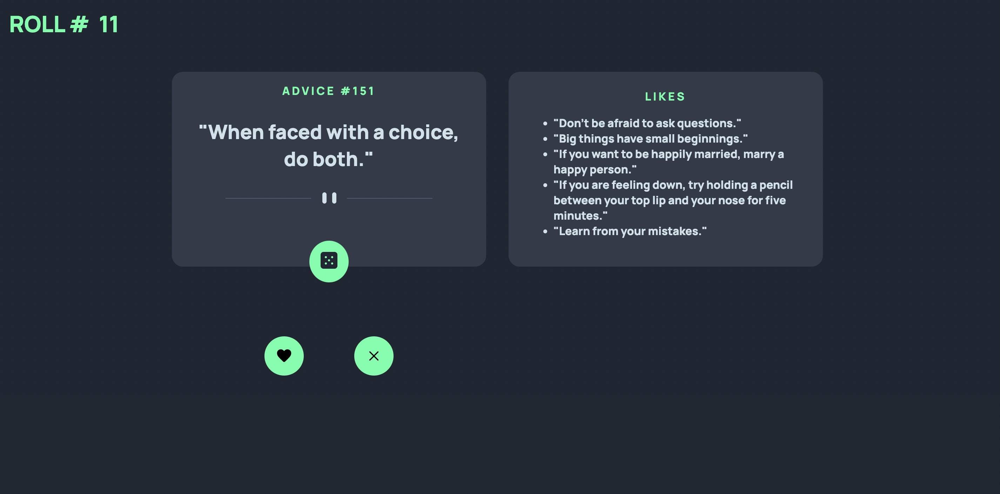

This is a solution to the [Advice generator app challenge on Frontend Mentor](https://www.frontendmentor.io/challenges/advice-generator-app-QdUG-13db). Frontend Mentor challenges help you improve your coding skills by building realistic projects.

**Preview**

**Built With**:
- HTML5
- CSS
- JS
- Advice slip API
- localStorage web API

**Features**:
- Generate a quote by tapping the 'dice' button || 'Enter/Return'
- Save a quote in the 'Likes' section by tapping the 'heart' button || 'S' key
- Delete your saves with the 'X' button || 'Backspace/Delete'
- Keep track of your total rolls for the session with the roll counter
- Keeps your likes saved to your device

**Purpose**:
- Fun to past the time with while possible getting advice that can 
  resonate with you.

